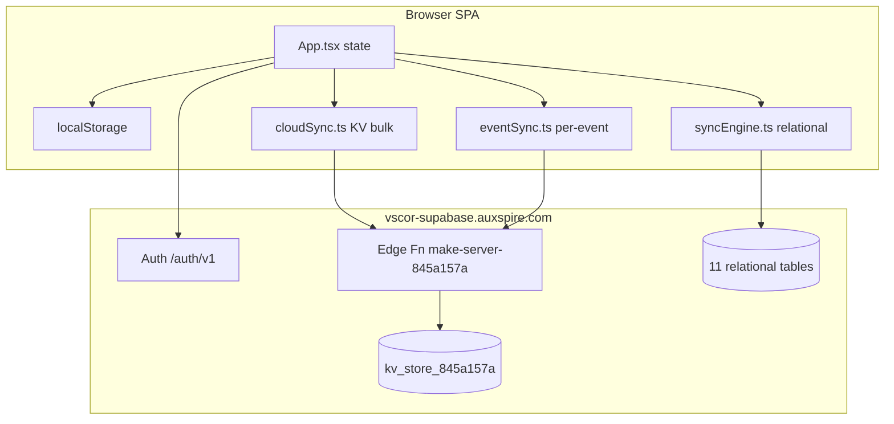

# VScor Live Scoring App — Technical Context

Standalone reference for the scoring SPA at **`/app/`** on vscor.in.  
Package: `@workspace/scoring` · Source: Figma Make export, integrated into the monorepo.

---

## 1. Product summary

VScor is an **offline-first, mobile-oriented football live-scoring PWA**. Organizers and scorers run matches in real time; spectators follow live scores. The app covers the full grassroots football operations loop:

| Domain | Capabilities |
|--------|----------------|
| **Auth** | Email/password, phone/password, Google OAuth; profile merge for unclaimed player records |
| **Players** | Profiles, multi-team membership, stats, leaderboards, ownership |
| **Teams** | Master team registry, squads, coordinators (up to 3), logos |
| **Tournaments** | Formats (knockout, round-robin, groups+knockout), fixtures, standings, seeding |
| **Matches** | Create → squad selection → live scoring → ratings → share/payments |
| **Live** | Dual-scorer mode, event-level sync, live polling on viewer screens |
| **Payments** | Match fee calculation and payment tracking (organizer tooling) |
| **Social** | Follow players/teams/tournaments, notifications, text/image share |

There is **no react-router**. All navigation is React state in `App.tsx` (`activeTab` + `currentView`).

---

## 2. Monorepo placement

```
vscore-landing/
├── artifacts/scoring/          ← this app (@workspace/scoring)
├── artifacts/worldcup/         ← predictor (untouched)
├── artifacts/website/          ← landing (untouched)
├── artifacts/api-server/       ← worldcup API
├── supabase/
│   ├── migrations/             ← kv_store + 11 relational tables
│   └── functions/make-server-845a157a/   ← edge function (Hono)
├── scripts/prepare-vercel-output.mjs
└── vercel.json                 ← /app/ SPA rewrite
```

| URL | Artifact |
|-----|----------|
| `/` | website |
| `/worldcup/` | worldcup |
| `/app/` | **scoring** |
| `/api/*` | api-server |

**Dev:** `pnpm run dev:scoring` → `http://localhost:24153/app/`  
**Build:** `BASE_PATH=/app/`, output `artifacts/scoring/dist/public` → copied to `dist/app/`

---

## 3. Tech stack

| Layer | Choice |
|-------|--------|
| UI | React 19, TypeScript, Tailwind CSS 4, Radix UI primitives |
| Motion | `motion` (Framer Motion successor) |
| Charts | Recharts |
| Build | Vite 7, `@tailwindcss/vite` |
| Auth & DB client | `@supabase/supabase-js` |
| Backend | Supabase Auth + Edge Function (Hono/Deno) + Postgres |
| Local persistence | `localStorage` (primary runtime store) |
| Share/export | `html2canvas` for match cards |

Env (same Supabase project as worldcup):

- `VITE_SUPABASE_URL` → `https://vscor-supabase.auxspire.com`
- `VITE_SUPABASE_ANON_KEY`
- `VITE_SCORING_FUNCTION_SLUG` (default: `make-server-845a157a`)

Config module: `src/lib/supabase-env.ts`

---

## 4. Architecture

### 4.1 High-level pattern

**Offline-first PWA with dual cloud sync paths:**



### 4.2 Two storage/sync layers (important)

The export contains **two parallel backends**. Both may be active depending on setup:

| Path | Client | Server | When used |
|------|--------|--------|-----------|
| **KV bulk sync** | `cloudSync.ts` | Edge function → `kv_store_845a157a` | **Primary** — startup `pullAllFromCloud()`, debounced push of 7 arrays |
| **Relational sync** | `syncEngine.ts` | Supabase `.from()` on 11 tables | **Secondary** — Database Setup Wizard, entity-level queue |

**KV keys (edge function):**

- `user:{uuid}` — VScor user profile
- `app_data:players`, `app_data:teams`, `app_data:tournaments`, `app_data:ongoing_matches`, `app_data:completed_matches`, `app_data:master_teams`, `app_data:tournament_teams`
- `match_events:{matchId}` — append-only event log (dual-scorer)

**localStorage keys:**

```text
vscor_current_user
vscor_players / vscor_teams / vscor_master_teams / vscor_tournament_teams
vscor_tournaments / vscor_matches
vscor_sync_queue / vscor_sync_status
```

### 4.3 Smart sync strategy

Documented in `src/SMART_SYNC_STRATEGY.md`:

- **Scorers** on `liveScoring` view → aggressive **push** (minimal debounce)
- **Viewers** on live screens → aggressive **pull** (~4s polling)
- Other screens → no global polling; saves server load vs legacy “poll everything every 3s”

Event-level sync (`eventSync.ts`) avoids “last write wins” when two scorers edit the same match.

---

## 5. Application shell (`App.tsx`)

~3,000 lines — central orchestrator.

### 5.1 Navigation model

**Tabs** (`TabType`):

| Tab | Component | Purpose |
|-----|-----------|---------|
| `live` | `LiveMatchesScreen` | Spectator live scores |
| `scoring` | `ScoringTab` | Scorer hub (new match, my matches) |
| `info` | `InfoTab` | Players, teams, tournaments, stats links |

**Views** (`ViewType`) — stack on top of tabs:

`main`, `newMatch`, `selectSquad`, `liveScoring`, `reviewRatings`, `addTeam`, `addTournament`, `addPlayer`, `playerProfile`, `teamProfile`, `tournamentProfile`, `matchEvents`, `editMatchEvents`, `playersList`, `teamsList`, `tournamentsList`, `statsPage`, `enterMatchResult`, `calculatePayment`, `playerMatches`, `myMatches`, `matchPayments`, `notifications`, `transferMatchOwnership`, `info`, `liveMatchDetails`

### 5.2 Startup flow

```
SplashScreen
  → LoginScreen (if not authenticated)
  → SyncInitializer
       → checkDatabaseSetup() [relational path]
       → optional DatabaseSetupWizard
       → DataMigration + SyncEngine.pull
       → pullAllFromCloud() [KV path]
  → Main app (tabs + bottom nav)
```

`SyncInitializer` phases: `checking_setup` → `setup_required` | `migrating` → `syncing` → `complete` | `local_only` | `error`

### 5.3 Core state (in App)

- `playerDatabase`, `registeredTeams`, `tournaments`
- `ongoingMatches`, `completedMatches`
- `currentUser`, `accessToken`
- `selectedMatch`, `selectedPlayer`, `selectedTeam`, `selectedTournament`
- Dark mode (`localStorage` + `document.documentElement.classList`)

All mutations flow through App handlers that update state + `localStorage` + trigger `debouncedSync` / `syncToCloud`.

---

## 6. Feature components (63 screens/widgets)

### Auth & onboarding
| File | Role |
|------|------|
| `SplashScreen.tsx` | Brand splash |
| `LoginScreen.tsx` | Email/phone sign-in/up, Google OAuth, merge dialog trigger |
| `AuthCallback.tsx` | OAuth hash token handling |
| `ProfileMergeDialog.tsx` | Claim or separate existing player profiles on signup/login |

### Match lifecycle
| File | Role |
|------|------|
| `NewMatch.tsx` | Create match (teams, tournament, venue) |
| `SelectSquad.tsx` | Pick starting squads |
| `LiveScoring.tsx` | In-match event recording (goals, cards, subs, etc.) |
| `LiveTimer.tsx` | Match clock |
| `ReviewRatings.tsx` | Post-match player ratings |
| `EnterMatchResult.tsx` | Quick result entry (non-live) |
| `MatchEventsScreen.tsx` | Event timeline / live view |
| `EditMatchEvents.tsx` | Correct events after the fact |
| `TransferMatchOwnership.tsx` | Reassign match owner/scorers |

### Entities
| File | Role |
|------|------|
| `AddPlayer.tsx`, `PlayersList.tsx`, `PlayerProfile.tsx`, `PlayerProfileScreen.tsx` | Player CRUD + detail |
| `AddTeam.tsx`, `TeamsList.tsx`, `TeamProfile.tsx`, `TeamProfileScreen.tsx` | Team CRUD + detail |
| `AddTournament.tsx`, `TournamentsList.tsx`, `TournamentProfileScreenUpdated.tsx` | Tournament hub (~4.4k lines) |
| `TournamentFixturesTab.tsx` | Fixture generation/display |
| `Leaderboard.tsx`, `StatsPage.tsx`, `StatsTab.tsx` | Rankings and analytics |

### Operations
| File | Role |
|------|------|
| `MyMatches.tsx` | User's matches |
| `MatchPayments.tsx`, `CalculatePayment.tsx` | Fee tooling |
| `Notifications.tsx` | In-app notification center |
| `ShareDialog.tsx`, `TextShareModal.tsx` | Share results |
| `DatabaseSetupWizard.tsx` | Relational DB setup UI |
| `SyncInitializer.tsx`, `SyncStatusIndicator.tsx` | Boot sync UX |

### UI kit
`src/components/ui/*` — shadcn-style Radix components (button, dialog, sheet, sidebar, etc.)

---

## 7. Utilities (`src/utils/`)

| Module | Responsibility |
|--------|----------------|
| `auth.ts` | Session, `getCurrentUser`, Google OAuth (popup in iframe), email/phone signup via edge `/auth/signup`, profile fetch `/users/profile` |
| `cloudSync.ts` | KV bulk pull/push, health check, debounce, 7 `SyncDataType` arrays |
| `eventSync.ts` | Per-match event POST/GET/poll/since/delete |
| `storage.ts` | localStorage load/save helpers |
| `ownership.ts` | `created_by`, `owner_user_id`, coordinator ACLs |
| `ownershipMigration.ts` | Backfill ownership on legacy data |
| `teamManagement.ts` | Master teams table (dedupe by name) |
| `teamFollows.ts`, `playerFollows.ts`, `tournamentFollows.ts` | Follow graph |
| `notifications.ts` | Local notification records |
| `ratingCalculation.ts` | Performance rating math |
| `tournamentFlexibility.ts` | Mid-tournament team add, format helpers |
| `tournamentValidation.ts` | Tournament state guards |
| `crashLogger.ts` | Structured client logging |
| `suppressAbortErrors.ts` | Supabase lock noise suppression |

### Database package (`src/utils/database/`)

| Module | Responsibility |
|--------|----------------|
| `supabaseClient.ts` | Singleton `createClient` (persist session, OAuth URL detect) |
| `syncEngine.ts` | Relational two-way sync, offline queue, `SyncStatusManager` |
| `setupChecker.ts` | Probe 11 Postgres tables; `getTableCreationSQL()` for wizard |
| `schema.ts` | TypeScript interfaces mirroring relational tables |
| `migration.ts` | One-time local→cloud data migration |
| `debugHelpers.ts` | Dev diagnostics |

---

## 8. Edge function API (`make-server-845a157a`)

Deployed from `supabase/functions/make-server-845a157a/`.  
Client base: `{VITE_SUPABASE_URL}/functions/v1/make-server-845a157a`

| Method | Path | Purpose |
|--------|------|---------|
| GET | `/health` | Liveness |
| POST | `/auth/signup` | Admin create user + VScor profile + player merge candidates |
| POST | `/auth/link-player-profile` | Merge or create_new after signup |
| POST | `/auth/check-unlinked-profiles` | Login-time unclaimed profile scan |
| POST | `/users/profile` | Get/create VScor user (canonical `user_id` = Supabase auth UUID) |
| GET | `/users/:userId` | Fetch user by id |
| POST | `/users/verify` | Phone verification metadata |
| GET | `/sync` | Bulk pull all 7 data types |
| GET/PUT | `/sync/:type` | Per-type read/write (`players`, `teams`, …) |
| POST | `/match-events/:matchId` | Append event (requires `X-User-Token`) |
| GET | `/match-events/:matchId` | List events |
| GET | `/match-events/:matchId/since/:timestamp` | Incremental poll |
| DELETE | `/match-events/:matchId/:eventId` | Undo event |

Auth headers:

- `Authorization: Bearer {anonKey}` — gateway validation
- `X-User-Token: {user JWT}` — optional identity for writes

---

## 9. Relational schema (11 tables)

Migrations: `supabase/migrations/20260615130100_scoring_relational_tables.sql`

`players`, `teams`, `team_players`, `tournaments`, `tournament_teams`, `matches`, `match_events`, `performance_ratings`, `standings`, `fixtures`, `seeding_data`

Each row includes sync metadata: `sync_status`, `last_synced_at`, `created_at`, `updated_at`.  
RLS: authenticated users only (broad read/write for any signed-in user).

KV table: `kv_store_845a157a` — no client policies; edge function uses service role.

---

## 10. Authentication details

| Method | Flow |
|--------|------|
| Email/password | Supabase `signInWithPassword` |
| Phone/password | Synthetic email `{digits}@vscor.phone` + edge signup |
| Google OAuth | `signInWithOAuth` with `redirectTo: appBaseUrl()`; popup mode in iframes |
| Signup | Edge `/auth/signup` auto-confirms email; may return `existing_player_profiles` |

**Profile merge:** When signup/login finds unowned player rows matching email/phone, `ProfileMergeDialog` lets the user merge or create a separate profile.

**User ID canonicalization:** VScor `user_id` should equal Supabase Auth UUID (`google_id` field). Legacy random UUIDs are migrated on `/users/profile`.

---

## 11. Match events taxonomy

See `src/docs/7-Event-Taxonomy.md`. Categories:

- Scoring (goal, penalty, own goal, assist)
- Shooting (on/off target)
- Defensive (interception, save)
- Discipline (foul, yellow, red)
- Match management (substitution, corner, offside)

Events carry: `id`, `type`, `team`, `player`, `minute`, `timestamp`, `recorded_by`, optional assist/substitution fields.

---

## 12. Ownership & permissions

| Entity | Rule |
|--------|------|
| Player | `owner_user_id` — only owner edits |
| Team | `owner_user_id` + up to 3 `coordinator_user_ids` |
| Tournament | `coordinator_user_ids` (creator included) |
| Match | `ownedBy`, `scoredBy1`, `scoredBy2` — transferable |

Helpers in `ownership.ts`; migration in `ownershipMigration.ts`.

---

## 13. Bundled documentation (from export)

Rich internal docs under `src/docs/` and `src/guidelines/`:

| Doc | Content |
|-----|---------|
| `1-Feature-Map.md` | Full feature tree |
| `2-Screen-Flow-Diagrams.md` | UX flows |
| `3-Database-Schema.md` | Logical + physical schema |
| `4-Component-Architecture.md` | Component relationships |
| `5-State-Management-Map.md` | State ownership |
| `6-API-Structure.md` | REST reference (some URLs pre-integration) |
| `7-Event-Taxonomy.md` | Match events |
| `8-System-Architecture.md` | Layer diagrams |
| `SMART_SYNC_STRATEGY.md` | Polling/push policy |
| `DUAL_SCORER_EVENT_SYNC_IMPLEMENTATION.md` | Multi-scorer design |
| `AUTHENTICATION_AND_OWNERSHIP.md` | Auth + ACL guide |

Also: many `*_SUMMARY.md` fix logs from Figma iteration (historical, not normative).

---

## 14. Integration notes & caveats

1. **Figma export quality:** Large components (`App.tsx`, `TournamentProfileScreenUpdated.tsx`) use `@ts-nocheck` for CI; runtime is fine, types are loose.
2. **Dual sync:** Production needs **both** KV edge function **and** (optionally) relational migrations. KV path is required for `pullAllFromCloud()` on boot.
3. **No data migration from old Figma project** (`zwavkgmumhlcmlvttosc`) — manual export/import if historical data matters.
4. **Legacy zip edge source** remains at `src/supabase/functions/server/` (reference only); deploy uses `supabase/functions/make-server-845a157a/`.
5. **Website link to `/app/`** intentionally not added in integration phase.
6. **Chunk size:** Production bundle ~1.4 MB JS (no code-splitting yet).

---

## 15. Verification checklist

**Local**
```bash
pnpm run dev:scoring
# http://localhost:24153/app/
```

**Build**
```bash
pnpm --filter @workspace/scoring run typecheck
pnpm --filter @workspace/scoring run build
```

**Production prerequisites** (see `DEPLOY.md`)
- [ ] Migrations applied
- [ ] Edge function deployed
- [ ] Auth redirect URLs configured
- [ ] Vercel env vars set

**Smoke**
1. Splash → login (email or Google)
2. `pullAllFromCloud()` / health check succeeds
3. Create team → start live scoring → complete match
4. Refresh — data persists
5. OAuth callback at `/app/` with hash tokens

---

## 16. File counts (approximate)

| Area | Count |
|------|-------|
| Total artifact files | ~217 |
| Feature components | 63 |
| UI primitives | ~45 |
| Utils / database | 28 |
| Internal markdown docs | 40+ |

---

*Generated from monorepo integration analysis. For deploy steps see `DEPLOY.md`. For integration plan see repo plan `scoring_app_integration` (not edited here).*
