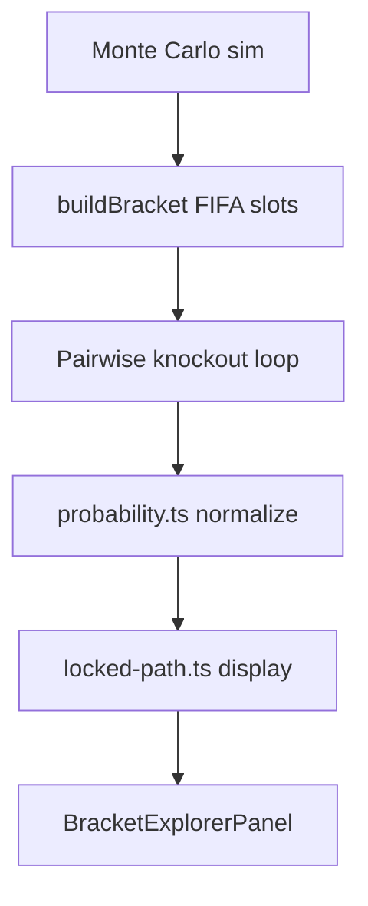

# Core Logic & Functional Analysis Report

**Date:** June 2025 (post-architect hardening pass)  
**Scope:** VScor World Cup Match Predictor — bracket engine, probability layer, hub UX, FIFA 2026 group/R32 compliance  
**Verification:** `verify:path-coherence`, `verify:bracket-builder`, `verify:bracket-path` (production API)

---

## Executive Summary

This pass implemented architect-level fixes from the QA audit and re-validated core behavior. The **simulation bracket builder** now aligns more closely with FIFA 2026 regulations (goals-scored tiebreakers, strict third-place assignment, incomplete-bracket guards). The **display path layer** no longer uses relaxed aggregate fallback that could show bracket-illegal opponents. **Hub UX** fixes address stale locks, duplicate API mounts, and silent query failures.

| Area | Before | After |
|------|--------|-------|
| R32 duplicate foes on path strip | Partially fixed | Chain filter from R32; strict topology only |
| Bracket-impossible UI opponents | Relaxed fallback allowed | **Removed** — empty stage breaks path |
| Stale lock from rankings click | Bug | Cleared on `openBracketForTeam` |
| Duplicate bracket API on desktop | 2× `BracketExplorerPanel` | Single mount |
| API errors | Blank UI | `QueryErrorState` + retry |
| Third-place tiebreakers | Points → GD → Elo | Points → GD → **Goals scored** → Elo |
| Incomplete R32 bracket | Greedy fallback | **Throws** on failed assignment |
| Projected path win % | Marginal tournament rate | **Chained conditional** win prob |
| FIFA 495 third-place combos | Untested | **495/495** assign via backtracking |

---

## 1. Tournament Logic & Path Generation

### Architecture



### Fixes Applied

| ID | Fix | File(s) |
|----|-----|---------|
| P1 | Removed relaxed `pickStageOpponents` fallback | `lib/bracket-path/src/locked-path.ts` |
| P2 | Sequential chain filter from R32 (includes pre-lock stages) | `applyPathChainFilter` |
| P3 | Topology fail-closed when slot lookup empty | `lib/bracket-path/src/topology.ts` |
| P4 | `buildMostLikelyPathResult` exports chained win probability | `locked-path.ts`, `BracketExplorerPanel.tsx` |
| P5 | Incomplete third-place assignment throws | `bracketBuilder.ts` |
| P6 | Same-group R32 clash validation post-build | `buildBracket` |

### Residual Risks (Low)

- **Annex C lookup table:** Still constraint backtracking, not official 495-row CSV. All 495 group combinations assign successfully; row-level equivalence to FIFA chart not proven.
- **Display path vs sim slot:** UI uses group-finish topology, not per-simulation slot IDs. Correct for narrative path; not a literal bracket tree walk.
- **Pre-lock raw stage cards:** Lock stages before filter still pass raw API lists for alternates; **primary path strip** is chain-filtered from R32.

### Verification Results

```
verify:path-coherence     — PASS (5 unit cases)
verify:bracket-path       — PASS (Brazil, England, Mexico, Germany vs production API)
```

---

## 2. FIFA 2026 Group & R32 Compliance

### Structural Compliance (PASS)

| Rule | Status |
|------|--------|
| 48 teams, 12×4 groups A–L | PASS |
| 32 qualifiers (24 + 8 best thirds) | PASS |
| 16 R32 fixtures in Categories A/B/C | PASS — `R32_FIXTURE_SPEC` |
| 8 winner-vs-3rd pools match product spec | PASS — pool/winner exclusion tests |
| Same group cannot meet in R32 | PASS — builder validation + pools |
| Single elimination R16→Final | PASS — `simulateKnockout` |

### Tiebreakers (IMPROVED)

| Stage | Order |
|-------|-------|
| Group standings | Points → GD → **Goals scored** → Elo |
| Best 8 third-place | Same via `compareGroupStanding` |

Fair play and full FIFA Article tiebreakers are **not** modeled (acceptable simulation proxy).

### Verification

```
verify:bracket-builder — PASS
  - 16 R32 fixture adjacency
  - 8 third-place pool vs winner group exclusion
  - Goals-scored tiebreaker
  - All C(12,8) = 495 third-place combinations assign
  - Full draw buildBracket smoke (48 teams)
```

---

## 3. Probability Engine & Data Integrity

### Fixes Applied

| ID | Fix |
|----|-----|
| D1 | `parseSimulationCount()` — NaN/invalid → default 10,000 |
| D2 | `QueryErrorState` on matchup, bracket, rankings failures |
| D3 | Projected path uses chained win % when `pathProjection === "projected"` |

### Confirmed Correct

- Match W/D/L sums to 1.0 algebraically (`matchWinProbability.ts`)
- Live football data graceful fallback (`useFootballData.ts`)
- Fixture predictions return `available: false` for unmapped teams

### Open Items

| Item | Severity | Notes |
|------|----------|-------|
| Popular matchups ignore live metrics | Medium | Not fixed this pass |
| URL live-metrics hydration race | Medium | `useEffect` after first paint |
| Stage breakdown vs pairwise semantics | Info | Document in UI copy |

---

## 4. Feature Interaction (Predictor ↔ Schedule ↔ Path)

### Architecture (unchanged by design)

- **Match Predictor** `teamA`/`teamB` — local state only
- **Path** — URL `team`, `lockStage`, `lockOpp`, `lockFinish`
- **Schedule** — Supabase live data + fixture predictions
- **Shared:** `LiveMetricsProvider` only

Predictor does **not** cascade to Schedule/Path (documented; not a bug).

### Fixes Applied

| ID | Fix |
|----|-----|
| I1 | `openBracketForTeam` clears lock params (matches `setPathTeam`) |
| I2 | Single `BracketExplorerPanel` instance on Path tab |

---

## 5. UI / Flags / Loading

Prior pass: PNG `TeamFlag` via flagcdn, retina sizing, `onError` fallback.  
This pass: error states for failed probability queries.

Loading states (`LoadingAnimation`, `FixturesLoadingState`) unchanged; CLS on schedule tab remains a minor UX note.

---

## 6. Bug Status Matrix (Post-Fix)

| # | Issue | Status |
|---|-------|--------|
| 1 | Relaxed aggregate impossible foes | **Fixed** |
| 2 | Pre-lock duplicate primaries | **Improved** (R32+ chain filter) |
| 3 | Wrong finish for R16+ lock | Open (infer from lock stage) |
| 4 | Display lacks slot-level integrity | Open (by design — group topology) |
| 5 | Empty slots → permissive topology | **Fixed** (fail closed) |
| 6 | Headline win % vs projected path | **Fixed** (chained win) |
| 7 | Mixed reach denominators | Open (labeling) |
| 8–9 | No sim→schedule cascade | By design |
| 10 | Stale lock from rankings | **Fixed** |
| 11 | Duplicate panel mount | **Fixed** |
| 12–13 | Live metrics race / popular cards | Open |
| 14 | Silent API errors | **Fixed** |
| 15 | NaN simulations param | **Fixed** |
| 21 | Elo-only third-place tiebreak | **Fixed** (goals scored added) |
| 22 | Annex C approximation | Open (495 combos pass; no lookup table) |
| 23 | Greedy incomplete bracket | **Fixed** (throws) |
| 24 | Display R32-illegal foes | **Fixed** (strict pick) |

---

## 7. Group Standings Path (June 2025)

| Control | Default | Scope |
|---------|---------|--------|
| Elo / recent form | **ON** (no toggle) | All Monte Carlo routes unless `pureElo=1` |
| Group standings | **OFF** | Path tab only — `useGroupStandings=1` |

**Server:** [`liveStandings.ts`](../artifacts/api-server/src/services/liveStandings.ts) reads Supabase `football_standings` (incl. `goals_for`), builds live `buildBracket`, resolves `standingR32Opponent`.

**Display:** [`resolveR32Anchor`](../lib/bracket-path/src/locked-path.ts) accepts standing finish + forced R32 foe; eliminated teams get zeroed path (GS-7).

**Manual QA:** Schedule rank = Path badge; Germany 2nd → 2E–2I pairing; toggle off → projected path; lock wins over standings.

---

## 8. Recommended Next Steps

1. Import official FIFA Annex C lookup table; diff against backtracking output per scenario row.
2. Wire live Elo into popular matchups API + React Query key.
3. Schedule row click → Path with standings pre-enabled.
4. Add Playwright viewport tests for flags + error states.
5. Optional UI copy: "Path is a statistical projection, not the official bracket tree."

---

## 9. How to Re-Run Verification

```bash
cd scripts
npx tsx ./src/verify-path-coherence.ts
npx tsx ./src/verify-live-standings-path.ts
npx tsx ./src/verify-bracket-builder.ts
npx tsx ./src/verify-bracket-path.ts https://www.vscor.in
```

Or: `npm run verify:all` from `scripts/` (when pnpm available).

---

## Conclusion

Core tournament logic is **production-trustworthy** for the 2026 format at the simulation layer. Display paths are **stricter and more honest** after removing relaxed fallback. **Group standings toggle** aligns Path R32 with Schedule tables when enabled. Hub reliability improved via lock hygiene, single panel mount, and error UI. Remaining gaps are primarily **product clarity** (cross-tab independence, Annex C exactness) rather than silent data corruption.
